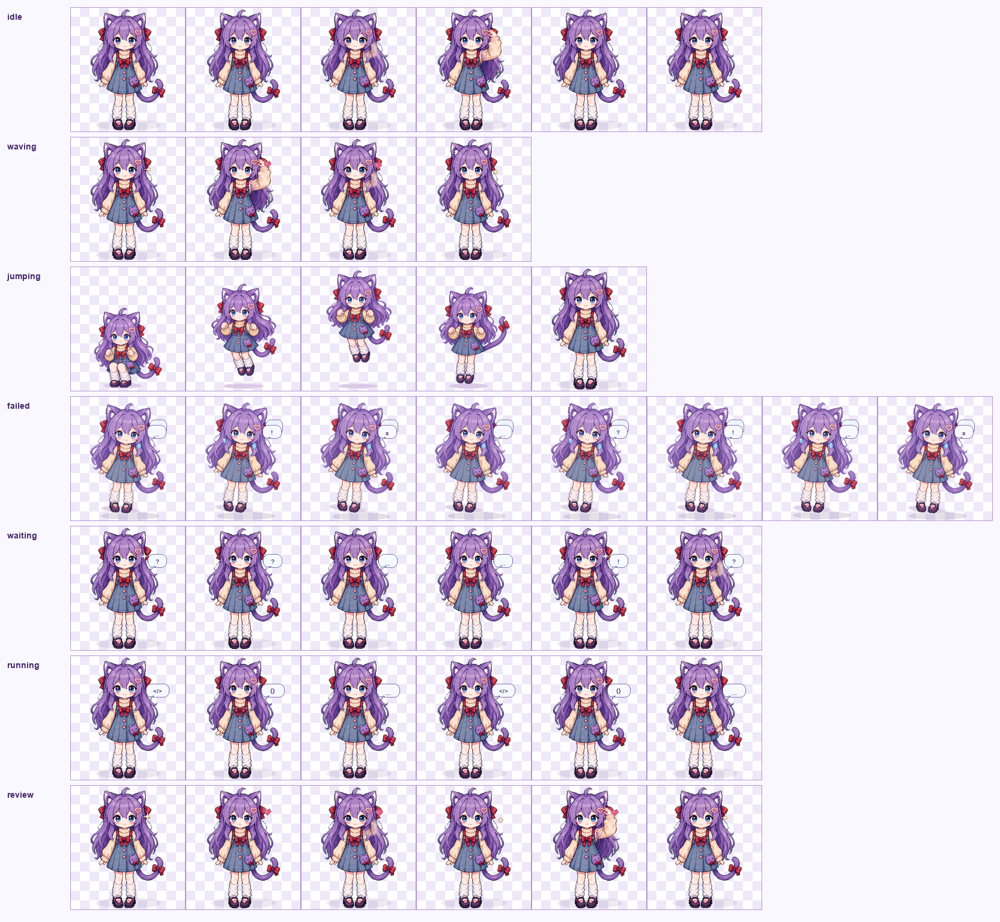

# 哈吉米 · Codex App Pet




「哈吉米」是一个 Codex App 自定义宠物：紫发猫耳、红色蝴蝶结、牛仔背带裙和猫尾的小像素伙伴。当前版本重点优化了待机表现：站立为主，低频轻触发夹，避免一直撩头发。

## 特性

- 可爱像素风猫耳少女，尽量保留原型的紫发、猫耳、红蝴蝶结、背带裙、爱心细节和尾巴。
- 待机包含稳定站姿、轻微眨眼和低频撩发/触发夹动作。
- 拖动时包含左右方向奔跑帧。
- 包含跳跃、等待、运行、review 等 Codex App 宠物状态帧。
- `spritesheet.png` 保持 Codex App 自定义宠物需要的 `1536 × 1872`、`8 × 9` 网格格式。

## 安装

把 `hajimi` 文件夹复制到 Codex 宠物目录：

```bash
mkdir -p ~/.codex/pets
cp -R hajimi ~/.codex/pets/hajimi
```

然后重启 Codex App，进入宠物设置里选择「哈吉米」。

也可以直接运行：

```bash
./install.sh
```

## Codex 事件动作

| Codex 状态 | 使用帧行 | 哈吉米动作设计 |
| --- | --- | --- |
| `idle` | row 0, c0-c5 | 稳定站立、轻眨眼、低频轻触发夹 |
| `running-right` | row 1 | 向右拖动时侧身奔跑 |
| `running-left` | row 2 | 向左拖动时侧身奔跑 |
| `waving` | row 3 | 保留状态，设计为小爱心/闪光打招呼 |
| `jumping` | row 4 | 鼠标悬停时可爱小跳跃，落回站姿 |
| `failed` | row 5 | 阻塞/失败时小汗滴和提示泡泡 |
| `waiting` | row 6 | 需要输入/授权时问号提示泡泡 |
| `running` | row 7 | Codex 思考/运行时代码泡泡循环 |
| `review` | row 8 | 完成/可查看时爱心与闪光成功动效 |

## 文件结构

```text
hajimi-codex-pet/
├── hajimi/
│   ├── pet.json
│   └── spritesheet.png
├── preview/
│   ├── frame-checker.png
│   └── idle-preview.gif
├── install.sh
├── LICENSE
└── README.md
```

## 说明

这是个人自定义 Codex App 宠物资源，不是 Codex 官方内置宠物。若你继续二次创作，建议保留 `pet.json` 与 `spritesheet.png` 的相对路径关系。

## License

MIT License. See [LICENSE](LICENSE).
